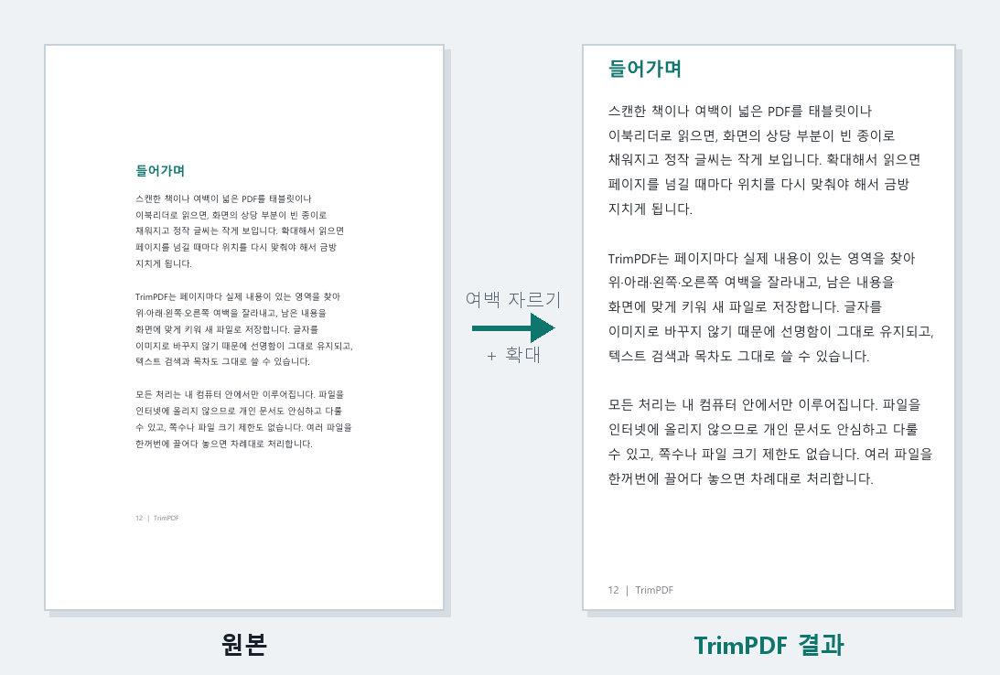
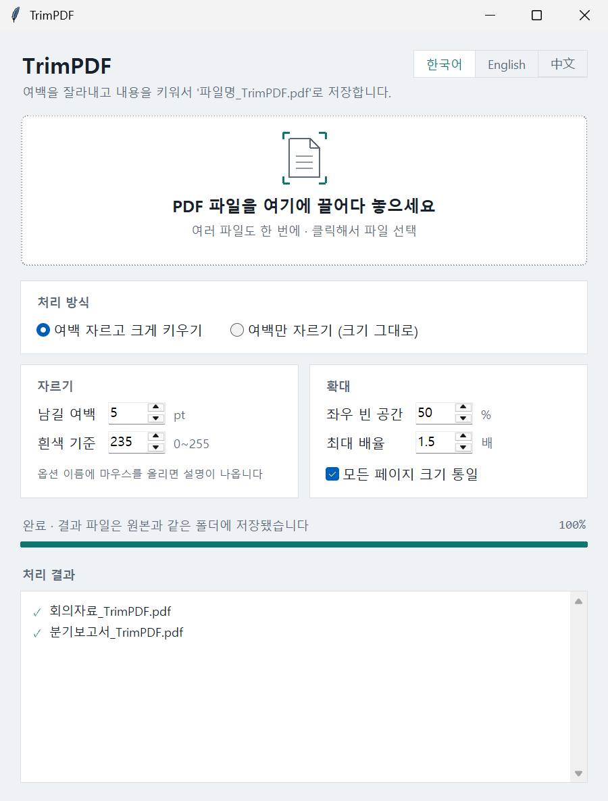

# TrimPDF

PDF 여백 자르기·확대 무료 프로그램 (Windows)
Trim PDF margins and enlarge the content — free Windows app.

스캔한 책이나 여백이 넓은 PDF를 태블릿·이북리더로 읽으면 화면의 절반이 빈 종이이고, 정작 글씨는 작아서 답답합니다.
TrimPDF는 PDF를 창에 끌어다 놓기만 하면 페이지마다 위·아래·왼쪽·오른쪽 여백을 찾아 잘라내고, 내용을 키워서 새 파일로 저장합니다.



## 특징

- **드래그 한 번:** PDF를 창이나 exe 아이콘에 놓으면 바로 처리합니다. 여러 파일도 한꺼번에 됩니다.
- **원본은 그대로:** 결과는 같은 폴더에 `파일명_TrimPDF.pdf`로 저장됩니다.
- **글자는 선명하게:** 페이지를 이미지로 바꾸지 않아 텍스트 선택·검색과 목차가 유지됩니다.
- **스캔본도 깔끔하게:** 누렇게 바랜 종이 배경, 먼지, 가장자리 그림자를 무시하고 실제 내용만 찾습니다.
- **읽기 편한 결과:** 모든 페이지 크기를 통일하고, 그림 한 장뿐인 페이지가 지나치게 커지지 않게 확대를 제한합니다.
- **내 PC에서만 처리:** 파일을 인터넷에 올리지 않습니다. 쪽수나 파일 크기 제한도 없습니다.
- **한국어 · English · 中文** 화면을 지원합니다.



## 다운로드와 사용법

1. [Releases](https://github.com/microhan1/TrimPDF/releases/latest)에서 `TrimPDF.exe`를 받습니다. 설치는 필요 없습니다.
2. 실행한 뒤 PDF를 창에 끌어다 놓습니다.
3. 원본과 같은 폴더에 `파일명_TrimPDF.pdf`가 생깁니다.

> 처음 실행할 때 「Windows의 PC 보호」 창이 뜨면 **추가 정보 → 실행**을 누르세요. 코드 서명 인증서가 없는 개인 제작 프로그램이라 나타나는 안내입니다.

옵션 설명과 문제 해결은 [사용 설명서](TrimPDF_Manual.html)(한국어 · English · 中文)에 정리돼 있습니다.

### 주요 옵션

| 옵션 | 기본값 | 하는 일 |
|---|---|---|
| 처리 방식 | 여백 자르고 크게 키우기 | 「여백만 자르기」를 고르면 크기를 키우지 않습니다 |
| 남길 여백 | 5 pt | 찾은 내용 둘레에 남기는 여유 (1 pt ≈ 0.35 mm) |
| 흰색 기준 | 235 | 이 값보다 어두운 부분을 내용으로 봅니다 |
| 좌우 빈 공간 | 50 % | 내용이 좁을 때 좌우에 남기는 공간의 비율 |
| 최대 배율 | 1.5 × | 확대 한도 (0 = 제한 없음) |
| 모든 페이지 크기 통일 | 켜짐 | 넘길 때 페이지 크기가 바뀌지 않게 맞춥니다 |

## 알아둘 점

- 원본 PDF의 링크, 메모·주석, 입력 양식은 결과 파일에 옮겨지지 않습니다.
- 암호가 걸린 PDF는 처리할 수 없습니다.
- 언어 선택은 `%APPDATA%\TrimPDF\settings.json`에 저장됩니다.

## 소스에서 실행하기

Python 3.10 이상이 필요합니다.

```bash
pip install -r requirements.txt
python trimpdf.py
```

실행 파일(exe) 만들기:

```bash
pip install pyinstaller
pyinstaller --noconfirm --onefile --windowed --name TrimPDF --collect-data tkinterdnd2 --collect-binaries tkinterdnd2 trimpdf.py
```

결과는 `dist/TrimPDF.exe`에 만들어집니다.

### 동작 원리

1. 페이지를 저해상도로 그려 종이 배경 밝기를 재고, 배경보다 확실히 어두운 부분을 약 1 mm 칸 단위로 찾습니다.
2. 확대 한도와 좌우 빈 공간 비율로 결과 페이지 크기를 정하고, 크기 통일이 켜져 있으면 대표 크기(중앙값)로 맞춥니다.
3. 원본 페이지의 내용 영역을 새 페이지에 PDF 그대로 옮겨 배치합니다. 회전된 페이지와 가로형 페이지도 방향을 유지합니다.

## English

TrimPDF detects the actual content area on every page of a PDF, trims the top, bottom, left and right margins, enlarges the content, and saves the result as `filename_TrimPDF.pdf`. It is handy for reading scanned books or wide-margin documents on tablets and e-readers.

- Download `TrimPDF.exe` from [Releases](https://github.com/microhan1/TrimPDF/releases/latest), run it, and drop PDF files onto the window.
- Text stays vector (selectable and searchable); files never leave your PC.
- The interface is available in Korean, English and Chinese (Simplified).
- User guide in Korean, English and Chinese: [TrimPDF_Manual.html](TrimPDF_Manual.html)

## 라이선스 / License

[GNU Affero General Public License v3.0](LICENSE)

이 프로그램은 AGPL-3.0 라이선스인 [PyMuPDF](https://github.com/pymupdf/PyMuPDF)를 사용하므로 같은 라이선스로 공개합니다.

사용한 오픈소스: PyMuPDF (AGPL-3.0), NumPy (BSD-3-Clause), tkinterdnd2 (MIT), PyInstaller (GPL-2.0 with bootloader exception)
